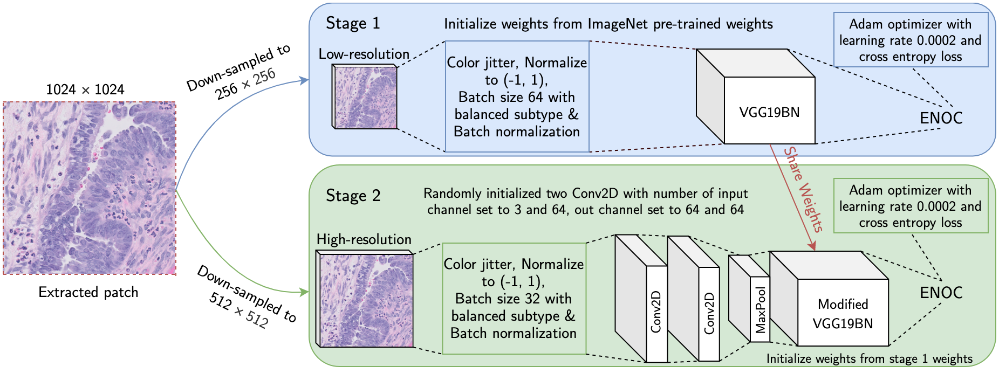
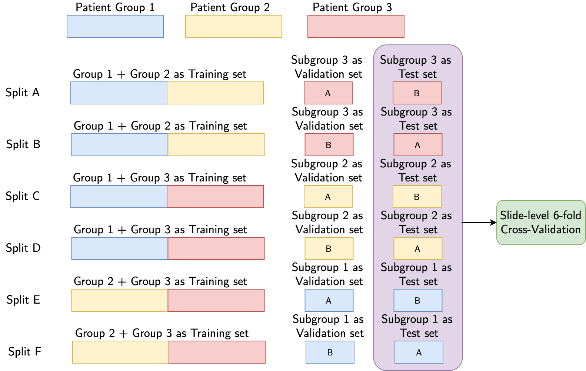

# MIDL2020

<p align="center">

</p>


This is the implementation of the [Classification of Epithelial Ovarian Carcinoma Whole-Slide Pathology Images Using Deep Transfer Learning](https://openreview.net/forum?id=VXdQD8B307). The code was written by [Yiping Wang](mailto:yiping@wang.vision). If you use this code for your research, please cite:

```
@inproceedings{
wang2020classification,
title={Classification of Epithelial Ovarian Carcinoma Whole-Slide Pathology Images Using Deep Transfer Learning},
author={Yiping Wang, David Farnell, Hossein Farahani, Mitchell Nursey, Basile Tessier-Cloutier, Steven J.M. Jones, David G. Huntsman, C. Blake Gilks, Ali Bashashati},
booktitle={Submitted to Medical Imaging with Deep Learning},
year={2020},
url={https://openreview.net/forum?id=VXdQD8B307},
note={under review}
}
```

Our work is inspired by [ProGAN](https://github.com/tkarras/progressive_growing_of_gans) and [fast.ai](https://www.fast.ai/2018/04/30/dawnbench-fastai/).

# Prerequisites
- Linux or macOS
- Python 3.5.2
- PyTorch 1.0.0
- scikit-learn 0.22.2.post1
- NVIDIA GPU + CUDA CuDNN

# Get Started
### Installation
- Install the required packages
`pip install -r requirements.txt`

- Clone this repo
```
mkdir wsi_classification
cd wsi_classification
git clone https://github.com/AliBashashati/MIDL2020
cd midl2020
```

### Patch extraction
First of all, the `enum` in `utils/subtype_enum.py` should be defined.

Afterwards, we extract the 1024 * 1024 patches and then downsampled to 512 * 512 and 256 * 256 using the `extract_patches.py`. This script not only extract patches, but also store the patches into a H5 file for easy data transfer and management. However, we use our own data annotation file so the annotation parse and check portion needs to changed for other dataset. 

### Patch-level: train, validation and test

**A detailed explanation of the data splits and results in the short paper are available in the section Datasets**

The following bash script is used to invokve training, validation and test:
```
#!/bin/bash
chmod 775 ./maestro.py
echo 'Two-stage model using split A'

echo 'Stage 1 - Patch Size 256 * 256 Training'
./patch_level.py  --deep_model DeepModel --deep_classifier multi_stage --model_name_prefix split_a --use_pretrained --lr 0.0002 --batch_size 64 --epoch 20 --rep_intv 250 --use_equalized_batch --n_eval_samples 2000 --is_multiscale_expert --expert_magnification 256 --dataset_dir /projects/ovcare/classification/ywang/midl_dataset/1024_resize --preload_image_file_name 1024_resize.h5 --train_ids_file_name patch_ids/1_2_train_3_eval_train_ids.txt  --val_ids_file_name patch_ids/1_2_train_3_eval_eval_0_ids.txt --log_dir /projects/ovcare/classification/ywang/project_log/1024_resize_log/ --save_dir /projects/ovcare/classification/ywang/project_save/1024_resize_save/
echo 'Stage 1 - Patch Size 256 * 256 Validation'
./patch_level.py  --mode Validation --deep_model DeepModel --deep_classifier multi_stage --model_name_prefix split_a --use_pretrained --lr 0.0002 --batch_size 64 --epoch 20 --rep_intv 250 --use_equalized_batch --n_eval_samples 2000 --is_multiscale_expert --expert_magnification 256 --dataset_dir /projects/ovcare/classification/ywang/midl_dataset/1024_resize --preload_image_file_name 1024_resize.h5 --train_ids_file_name patch_ids/1_2_train_3_eval_train_ids.txt  --val_ids_file_name patch_ids/1_2_train_3_eval_eval_0_ids.txt --log_dir /projects/ovcare/classification/ywang/project_log/1024_resize_log/ --save_dir /projects/ovcare/classification/ywang/project_save/1024_resize_save/

echo 'Stage 2 - Patch Size 512 * 512 Training'
./patch_level.py  --deep_model DeepModel --deep_classifier multi_stage --model_name_prefix split_a --use_pretrained --lr 0.0002 --batch_size 32 --epoch 20 --rep_intv 250 --use_equalized_batch --n_eval_samples 2000 --is_multiscale_expert --expert_magnification 512 --dataset_dir /projects/ovcare/classification/ywang/midl_dataset/1024_resize --preload_image_file_name 1024_resize.h5 --train_ids_file_name patch_ids/1_2_train_3_eval_train_ids.txt  --val_ids_file_name patch_ids/1_2_train_3_eval_eval_0_ids.txt --log_dir /projects/ovcare/classification/ywang/project_log/1024_resize_log/ --save_dir /projects/ovcare/classification/ywang/project_save/1024_resize_save/
echo 'Stage 2 - Patch Size 512 * 512 Validation'
./patch_level.py  --mode Validation --deep_model DeepModel --deep_classifier multi_stage --model_name_prefix split_a --use_pretrained --lr 0.0002 --batch_size 32 --epoch 20 --rep_intv 250 --use_equalized_batch --n_eval_samples 2000 --is_multiscale_expert --expert_magnification 512 --dataset_dir /projects/ovcare/classification/ywang/midl_dataset/1024_resize --preload_image_file_name 1024_resize.h5 --train_ids_file_name patch_ids/1_2_train_3_eval_train_ids.txt  --val_ids_file_name patch_ids/1_2_train_3_eval_eval_0_ids.txt --log_dir /projects/ovcare/classification/ywang/project_log/1024_resize_log/ --save_dir /projects/ovcare/classification/ywang/project_save/1024_resize_save/
```

### Slide-level: train and test
We train Random Forests using six-fold cross validation on the results of six patch-level test set. 

After changing the path to the six patch-level results in the `slide_level.py`, simply run `python3 slide_level.py` and it will output the slide-level results as well as save the trained model. 


# Datasets and Detailed Results
The epithelial ovarian carcinoma whole-slide pathology images used in this study are available from the [corresponding author](mailto:ali.bashashati@ubc.ca) upon reasonable request.

Our dataset has the following distribution in terms of patients, slides, and 1024 * 1024 tumor patches:
|Data Type|CC|LGSC|EC|MC|HGSC|Total|
| --- | --- | --- | --- | --- | --- | --- |
|Patient|32|14|28|9|76|159|
|Slide|53|29|55|11|157|305|
|Patch|16.49%|16.31%|12.93%|10.96%|43.31%|161516|

We first randomly divided the datasets by patients into three groups. We denote these three groups as Group 1, Group 2, and Group 3. 

Group 1 has the following distributions:
|Data Type|CC|LGSC|EC|MC|HGSC|Total|
| --- | --- | --- | --- | --- | --- | --- |
|Patient|11|5|10|3|26|55|
|Slide|20|8|14|4|54|100|
|Patch|15.23%|10.43%|11.44%|13.93%|48.98%|56034|

Group 2 has the following distributions:
|Data Type|CC|LGSC|EC|MC|HGSC|Total|
| --- | --- | --- | --- | --- | --- | --- |
|Patient|11|5|10|3|26|55|
|Slide|16|8|26|3|60|113|
|Patch|12.30%|17.80%|15.51%|7.09%|47.30%|64855|

Group 3 has the following distributions:
|Data Type|CC|LGSC|EC|MC|HGSC|Total|
| --- | --- | --- | --- | --- | --- | --- |
|Patient|10|4|8|3|24|49|
|Slide|17|13|15|4|43|92|
|Patch|24.91%|22.05%|10.89%|13.03%|29.12%|40627|

## Patch-level Results
For patch-level classification, we employ a 3-fold cross-validation scheme with a tweak. We use two of three patient groups as the training set and divide the remaining group equally by patient into two subgroups, one of the subgroups will be used as validation *or* test set. Therefore, we eventually have 6 different training, validation and test set. For slide-level classification, we only use the patch-level test set results to build the input matrix, and we report the 6-fold cross-validation slide-level results.

<p align="center">

</p>

### Split A Distribution, Baseline results, Stage-1 results, and Stage-2 results

#### Training set
|Data Type|CC|LGSC|EC|MC|HGSC|Total|
| --- | --- | --- | --- | --- | --- | --- |
|Patient|22|10|20|6|52|110|
|Slide|36|16|40|7|114|213|
|Patch|13.66%|14.39%|13.62%|10.26%|48.08%|120889|

#### Validation set
|Data Type|CC|LGSC|EC|MC|HGSC|Total|
| --- | --- | --- | --- | --- | --- | --- |
|Patient|5|2|4|2|12|25|
|Slide|7|3|9|3|19|41|
|Patch|17.31%|27.79%|7.85%|31.73%|15.33%|14594|

#### Test set
|Data Type|CC|LGSC|EC|MC|HGSC|Total|
| --- | --- | --- | --- | --- | --- | --- |
|Patient|5|2|4|1|12|24|
|Slide|10|10|6|1|24|51|
|Patch|29.18%|18.83%|12.59%|2.55%|36.85%|26033|

#### Baseline test results
|Model|CC|LGSC|EC|MC|HGSC|Weighted Accuracy|Kappa|AUC|F1 Score|Average Accuracy|
| --- | --- | --- | --- | --- | --- | --- | --- | --- | --- | --- |
|Baseline|99.22%|89.60%|73.89%|100.00%|75.05%|85.33%|0.8015|0.9739|0.8546|87.55%|

#### Stage-1 test results
|Model|CC|LGSC|EC|MC|HGSC|Weighted Accuracy|Kappa|AUC|F1 Score|Average Accuracy|
| --- | --- | --- | --- | --- | --- | --- | --- | --- | --- | --- |
|Stage-1|99.42%|79.05%|63.58%|99.85%|74.70%|81.97%|0.7543|0.9651|0.8105|83.32%|

#### Stage-2 test results
|Model|CC|LGSC|EC|MC|HGSC|Weighted Accuracy|Kappa|AUC|F1 Score|Average Accuracy|
| --- | --- | --- | --- | --- | --- | --- | --- | --- | --- | --- |
|Stage-2|99.50%|77.34%|72.70%|99.55%|72.64%|82.05%|0.7568|0.9658|0.8243|84.34%|


